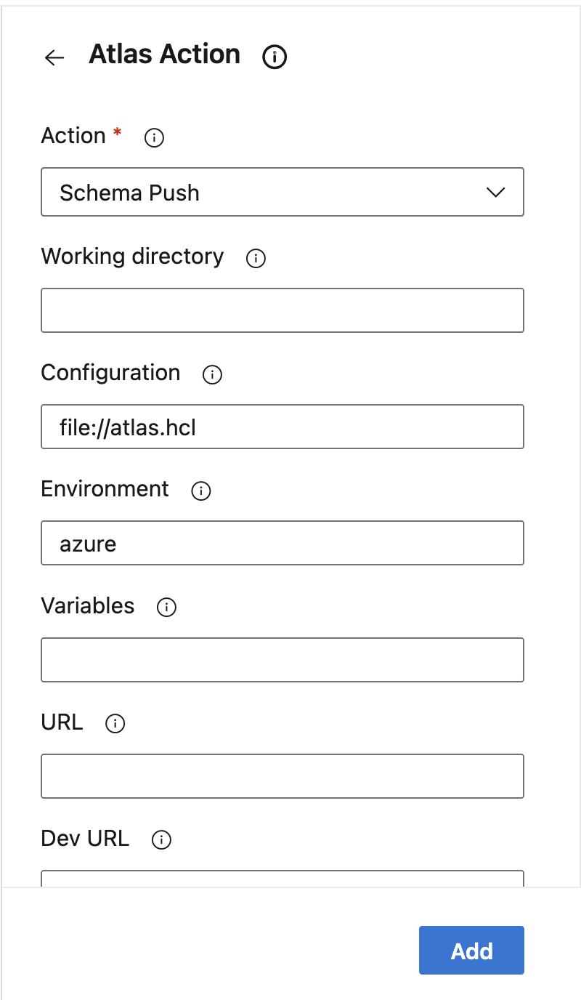

# Atlas Actions Extension for Azure DevOps

[](https://twitter.com/atlasgo_io)
[](https://discord.com/invite/zZ6sWVg6NT)

The extension providing `AtlasAction` task to run atlas-action on Azure DevOps.

## How to use

After installing the extension, you can add one (or more) of the tasks to [your pipeline](https://docs.microsoft.com/en-us/azure/devops/pipelines/?WT.mc_id=DOP-MVP-5001511&view=azure-devops).



Here is example pipeline that push the schema to [Atlas Registry](https://atlasgo.io/cloud/features/registry)

```yaml
trigger:
- master

pool:
  vmImage: ubuntu-latest

steps:
- script: curl -sSf https://atlasgo.sh | sh
  displayName: Install Atlas
- script: atlas login --token $(ATLAS_TOKEN)
  displayName: Atlas Login
- task: AtlasAction@1
  inputs:
    action: 'schema push'
    config: 'file://atlas.hcl'
    env: 'azure'
    schema_name: 'azure-devops'
```

## Features

- Support running Atlas-Actions on Azure DevOps (only Linux runner).
- Report lint result back to Pull Request on GitHub.
- Currently, only GitHub was supported as SCM.

## Support

Need help? File issues on the [Atlas Issue Tracker](https://github.com/ariga/atlas/issues) or join our [Discord](https://discord.com/invite/zZ6sWVg6NT) server.
