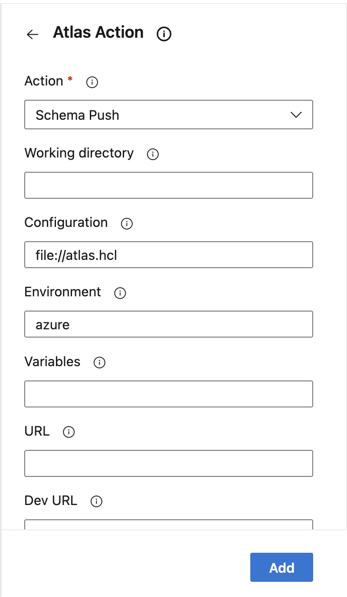

# Atlas Actions Extension for Azure DevOps

[](https://twitter.com/atlasgo_io)
[](https://discord.com/invite/zZ6sWVg6NT)

This extension provides the `AtlasAction` task to run atlas-action on Azure DevOps.

## How to use

After installing the extension, you can add one (or more) of the tasks to [your pipeline](https://docs.microsoft.com/en-us/azure/devops/pipelines/?WT.mc_id=DOP-MVP-5001511&view=azure-devops).



## Offline Access

Atlas Pro supports [offline access](https://atlasgo.io/cloud/bots#offline-access): after a successful `atlas login --token --grant-only`, Atlas caches a license grant in `~/.atlas`. Subsequent Atlas commands can use this cached grant even without connectivity to Atlas Cloud, so Atlas Cloud is never a single point of failure in your pipeline.

Use `action: setup` together with Azure Pipelines' built-in `Cache@2` task to persist the grant across pipeline runs. Because `Cache@2` only caches paths inside `$(Pipeline.Workspace)`, the setup action mirrors `~/.atlas` to and from `$(Pipeline.Workspace)/.atlas` automatically.

Add `Cache@2` **before** the setup step. Azure Pipelines runs post-job steps in reverse declaration order, so placing `Cache@2` first ensures its save step fires after the setup task's post-job hook has copied `~/.atlas` back into the workspace.

```yaml
trigger:
- master

pool:
  vmImage: ubuntu-latest

steps:
- task: Cache@2
  inputs:
    key: '"atlas-grant" | "$(Agent.OS)"'
    restoreKeys: '"atlas-grant"'
    path: $(Pipeline.Workspace)/.atlas
  displayName: Restore Atlas Grant Cache

- task: AtlasAction@1
  inputs:
    action: setup
    cloud_token: $(ATLAS_TOKEN)
  displayName: Setup Atlas

- task: AtlasAction@1
  inputs:
    action: 'schema push'
    config: 'file://atlas.hcl'
    env: 'azure'
    schema_name: 'azure-devops'
  displayName: Push Schema
```

The `Build.BuildId` in the primary cache key ensures a fresh entry is written each run (since Azure caches are immutable). The `restoreKeys` prefix `"atlas-grant" | "$(Agent.OS)"` restores the most recent entry from any previous run on the same OS.


## Features

- Support for running Atlas actions on Azure DevOps (Linux runners).
- Offline access via `action: setup` + `Cache@2` grant caching.
- Reporting lint results back to Pull Requests on GitHub and Azure Repos.
- Support for GitHub-hosted and Azure Repos-hosted repositories.

## Support

Need help? File issues on the [Atlas Issue Tracker](https://github.com/ariga/atlas/issues) or join our [Discord](https://discord.com/invite/zZ6sWVg6NT) server.
